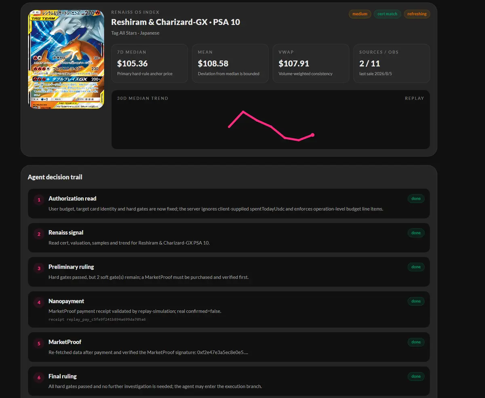
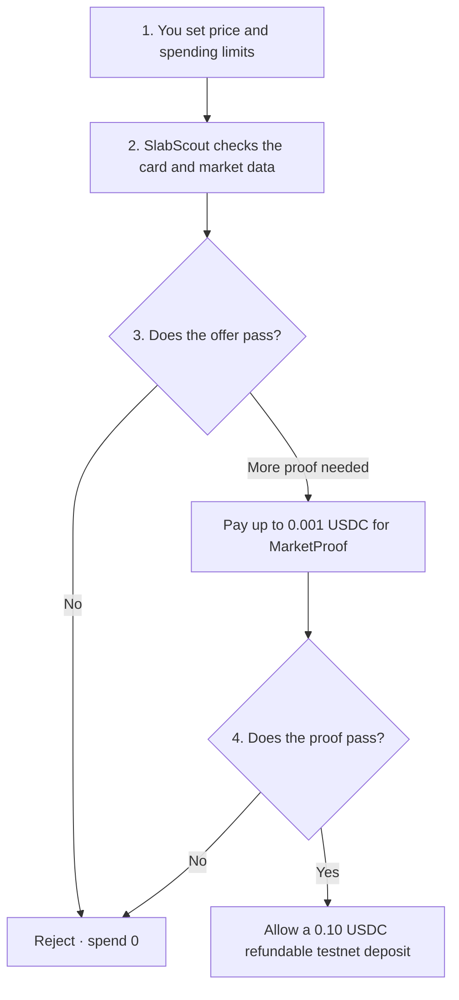

<div align="center">

# SlabScout

**Check the card. Check the price. Spend only inside your rules.**

SlabScout is a small AI-agent demo for graded trading-card offers.<br>
It checks the card and market price first, then decides whether to reject the offer, ask for more proof, or allow a small refundable testnet deposit.

<p>
  <a href="https://slabscout-800018.surf.computer/"></a>
  <a href="https://github.com/blueskylh/SlabScout/actions/workflows/ci.yml"></a>
  
  
</p>

[English](README.md) · [简体中文](README_CN.md)

</div>



> [!IMPORTANT]
> The public demo opens in **Replay mode**. It uses a fixed demo snapshot, and its payment and deposit are simulated. It does **not** spend real money, buy a physical card, or claim a real blockchain transaction.

## Try it in one minute

1. Open the **[live demo](https://slabscout-800018.surf.computer/)**.
2. Keep **REPLAY** selected.
3. Choose Seller A, B, or C.
4. Click **Run SlabScout Agent** and follow the decision trail.
5. Use the language button in the top-right corner to switch between English and Chinese.

| Demo offer | Result | Plain-English reason |
|---|---|---|
| Seller A · **$95** | ✅ `RESERVE` | The card, price, and market proof pass the rules. The test deposit is simulated. |
| Seller B · **$120** | ❌ `REJECT` | The price is above the user's limit, so SlabScout spends nothing. |
| Seller C · **$90** | ❌ `REJECT` | The price is low, but the data is too weak, so SlabScout spends nothing. |

## Why SlabScout exists

A card offer can look cheap and still be risky. It may be the wrong card, the price data may be old, or there may not be enough real sales to trust.

SlabScout follows a simple rule: **check first, spend second**.

Before it can move any testnet USDC, it checks:

- Is this the exact card, grade, and certificate?
- Is the seller's price inside the user's limit?
- Is the market data recent and strong enough?
- Is the proof fee inside the allowed amount?
- Is the deposit and daily budget still inside the user's limits?
- Did the proof and payment details match exactly?

If any required check fails, the answer is **no** and the agent stops.

## How it works



**MarketProof** is a small signed report made from market data. In the public Replay demo, paying for this report is simulated.

## Demo limits and current status

| Item | Current value |
|---|---|
| Public app | [slabscout-800018.surf.computer](https://slabscout-800018.surf.computer/) |
| Default public mode | Replay — safe, stable, and no real spending |
| Card data | Renaiss OS Index; Replay uses a fixed snapshot |
| Maximum proof fee | `0.001 USDC` |
| Maximum refundable deposit | `0.10 USDC` |
| Network | Arc Testnet only · chain ID `5042002` |
| Escrow contract | [`0xCB51…eD59`](https://testnet.arcscan.app/address/0xCB5185f2F445a143A3c5b2ec844B37dbb7D3eD59) |

The app also has an operator-only **Live** path. It needs an operator token, an authenticated Circle CLI session on the buyer machine, funded test wallets, and the full server setup. Live mode is not required to explore the public Replay demo.

## Run the safe demo locally

### What you need

- Node.js 22
- npm

### 1. Download and install

```bash
git clone https://github.com/blueskylh/SlabScout.git
cd SlabScout

npm --prefix backend ci --no-audit --no-fund
npm --prefix frontend ci --no-audit --no-fund

cp backend/.env.example backend/.env
cp frontend/.env.example frontend/.env
```

### 2. Start the backend

```bash
npm --prefix backend run dev
```

### 3. Start the frontend in a second terminal

```bash
npm --prefix frontend run dev
```

Open [http://localhost:5173](http://localhost:5173). The example settings start in Replay mode, so real Circle, Renaiss, and wallet credentials are not needed.

## Project map

| Folder | What is inside |
|---|---|
| [`frontend/`](frontend/) | The web page you see in the demo |
| [`backend/`](backend/) | The API, card checks, rules, proof checks, and payment controls |
| [`contracts/`](contracts/) | The Arc Testnet refundable-deposit contract |
| [`tests/`](tests/) | Automated tests for safe and unsafe paths |
| [`docs/`](docs/) | Detailed design, deployment, security, and demo notes |

## Safety rules

- **Testnet only.** Mainnet is not supported.
- **No full card purchase.** The project only demonstrates a tiny proof fee and refundable deposit.
- **Small fixed limits.** Proof fee: at most `0.001 USDC`; deposit: at most `0.10 USDC`.
- **Stop on uncertainty.** Missing data, a wrong card, a bad receipt, or an unknown transaction result blocks the next step.
- **Replay stays honest.** Simulated results never show a fake transaction hash, block number, or “real payment” label.
- **Secrets stay on the backend.** Never put wallet keys or API secrets in frontend `VITE_` variables or commit them to GitHub.

## Checks

GitHub Actions runs the same main checks on every pull request:

```bash
npm run secret-scan
npm test
npm run lint
npm --prefix frontend run lint
npm run type-check
BACKEND_PORT=3001 BASE_PATH=/ npm run build
BACKEND_PORT=3001 BASE_PATH=/ npm run smoke:backend
cd contracts && forge build && forge test -vvv
```

## More documentation

- [3-minute demo script](docs/DEMO_SCRIPT.md)
- [How the parts connect](docs/ARCHITECTURE.md)
- [Deployment guide](docs/DEPLOYMENT.md)
- [Security and failure cases](docs/THREAT_MODEL.md)
- [Pitch deck source](docs/PITCH_DECK.md)
- [Submission checklist](docs/SUBMISSION_CHECKLIST.md)

<details>
<summary><strong>Developer API routes</strong></summary>

| Route | Purpose |
|---|---|
| `GET /api/status` | Basic app and setup status |
| `GET /api/demo` | Demo offers, limits, and replay data |
| `POST /api/scout/run` | Run one SlabScout decision |
| `GET /api/scout/audits` | Read the decision history |
| `GET /api/status/live-readiness` | Run read-only checks before Live mode |
| `GET /api/market-proof/quote` | Read the MarketProof price |
| `POST /api/market-proof/prove` | Paid MarketProof seller endpoint for Live mode |

</details>

<details>
<summary><strong>Live-mode setup</strong></summary>

The public demo does not need this. For a real Arc Testnet run, see the full [deployment guide](docs/DEPLOYMENT.md). You will need:

- backend-only Renaiss credentials;
- an operator token and a writable single-instance state file;
- Circle CLI `0.0.6`, logged in to the intended Agent Wallet;
- funded Arc Testnet wallets and the MarketProof seller address;
- the deployed escrow address and Arc RPC URL.

Never commit real credentials or private keys.

</details>

---

<div align="center">

Built for the **Arc Agentic Economy** track with **Renaiss OS Index**, **Circle**, **Arc Testnet**, and **Surf**.

[Open the demo](https://slabscout-800018.surf.computer/) · [Read in Chinese](README_CN.md)

</div>
