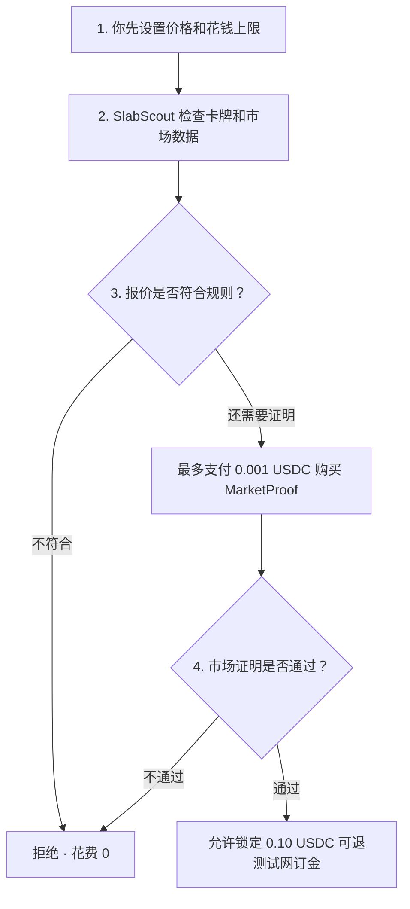

<div align="center">

# SlabScout

**先验卡，再验价；只有符合你的规则，AI 才能花钱。**

SlabScout 是一个面向评级收藏卡的 AI 助手演示。<br>
它会先检查卡牌和市场价格，再决定是拒绝报价、补充市场证明，还是允许锁定一小笔可退回的测试网订金。

<p>
  <a href="https://slabscout-800018.surf.computer/"></a>
  <a href="https://github.com/blueskylh/SlabScout/actions/workflows/ci.yml"></a>
  
  
</p>

[English](README.md) · [简体中文](README_CN.md)

</div>


> [!IMPORTANT]
> 公开 Demo 默认使用 **Replay（回放演示）模式**。它使用固定的演示数据，付款和订金都是模拟的。它**不会花真钱、不会购买实体卡牌，也不会把模拟结果说成真实链上交易**。

## 1 分钟体验

1. 打开 **[在线 Demo](https://slabscout-800018.surf.computer/)**。
2. 保持 **REPLAY** 模式，不要切换到 Live。
3. 选择 Seller A、B 或 C。
4. 点击 **运行 SlabScout 代理**，查看它一步步做决定。
5. 页面右上角可以切换英文和中文。

| 演示报价 | 结果 | 大白话解释 |
|---|---|---|
| Seller A · **95 美元** | ✅ `RESERVE` | 卡牌、价格和市场证明都符合规则，允许模拟锁定测试网订金。 |
| Seller B · **120 美元** | ❌ `REJECT` | 价格超过用户设置的上限，SlabScout 不花一分钱。 |
| Seller C · **90 美元** | ❌ `REJECT` | 虽然便宜，但数据不够可靠，SlabScout 仍然不花钱。 |

## SlabScout 解决什么问题？

一张卡看起来很便宜，不代表它真的值得买。它可能不是目标卡，价格数据可能已经过时，也可能根本没有足够的真实成交记录。

SlabScout 只遵守一个简单原则：**先检查，再花钱。**

在动用任何测试网 USDC 之前，它会检查：

- 卡牌、评级和证书号是不是完全一致？
- 卖家的价格有没有超过用户上限？
- 市场数据够不够新、够不够可靠？
- 市场证明费用有没有超过允许金额？
- 订金和当天预算有没有超标？
- 证明、付款信息和目标卡牌能不能完全对上？

任何一项必要检查失败，AI 都会停止，不再继续花钱。

## 它是怎么工作的？



**MarketProof（市场证明）** 可以简单理解成一份由市场数据生成、并带有签名的小报告。公开 Replay 演示中的这笔费用是模拟支付。

## Demo 当前状态和限制

| 项目 | 当前情况 |
|---|---|
| 在线地址 | [slabscout-800018.surf.computer](https://slabscout-800018.surf.computer/) |
| 公开默认模式 | Replay：安全、稳定、不花真钱 |
| 卡牌数据 | 来自 Renaiss OS Index；Replay 使用固定数据快照 |
| 市场证明费用上限 | `0.001 USDC` |
| 可退订金上限 | `0.10 USDC` |
| 网络 | 只支持 Arc Testnet，链 ID 为 `5042002` |
| 订金合约 | [`0xCB51…eD59`](https://testnet.arcscan.app/address/0xCB5185f2F445a143A3c5b2ec844B37dbb7D3eD59) |

页面也有只供操作者使用的 **Live 模式**。它需要操作者令牌、买方电脑上的 Circle CLI 登录状态、已有测试币的钱包，以及完整的服务器配置。普通用户体验公开 Demo 时，不需要使用 Live 模式。

## 在本地运行安全演示

### 需要准备

- Node.js 22
- npm

### 1. 下载并安装

```bash
git clone https://github.com/blueskylh/SlabScout.git
cd SlabScout

npm --prefix backend ci --no-audit --no-fund
npm --prefix frontend ci --no-audit --no-fund

cp backend/.env.example backend/.env
cp frontend/.env.example frontend/.env
```

### 2. 启动后端

```bash
npm --prefix backend run dev
```

### 3. 新开一个终端，启动前端

```bash
npm --prefix frontend run dev
```

然后打开 [http://localhost:5173](http://localhost:5173)。示例配置默认就是 Replay 模式，不需要填写真实的 Circle、Renaiss 或钱包密钥。

## 项目目录

| 文件夹 | 里面是什么 |
|---|---|
| [`frontend/`](frontend/) | Demo 中看到的网页 |
| [`backend/`](backend/) | API、卡牌检查、判断规则、证明检查和付款限制 |
| [`contracts/`](contracts/) | Arc Testnet 可退订金合约 |
| [`tests/`](tests/) | 测试正常流程和拒绝流程的代码 |
| [`docs/`](docs/) | 更详细的设计、部署、安全和演示说明 |

## 安全规则

- **只用测试网。** 不支持主网。
- **不购买整张卡。** 项目只演示一笔很小的证明费用和可退订金。
- **金额上限很小。** 证明费用最多 `0.001 USDC`，订金最多 `0.10 USDC`。
- **不确定就停止。** 数据缺失、卡牌不对、付款记录不对，或交易结果无法确认，都会阻止下一步。
- **不伪造交易结果。** Replay 模式不会显示假的交易哈希、区块号或“真实支付成功”。
- **密钥只放后端。** 不要把钱包私钥或 API 密钥写进前端 `VITE_` 变量，也不要提交到 GitHub。

## 自动检查

每次提交 Pull Request，GitHub Actions 都会运行这些主要检查：

```bash
npm run secret-scan
npm test
npm run lint
npm --prefix frontend run lint
npm run type-check
BACKEND_PORT=3001 BASE_PATH=/ npm run build
BACKEND_PORT=3001 BASE_PATH=/ npm run smoke:backend
cd contracts && forge build && forge test -vvv
```

## 更多文档

- [3 分钟演示脚本](docs/DEMO_SCRIPT.md)
- [各部分如何连接](docs/ARCHITECTURE.md)
- [部署说明](docs/DEPLOYMENT.md)
- [安全问题和失败情况](docs/THREAT_MODEL.md)
- [路演稿源文件](docs/PITCH_DECK.md)
- [提交检查表](docs/SUBMISSION_CHECKLIST.md)

<details>
<summary><strong>开发者 API</strong></summary>

| 地址 | 作用 |
|---|---|
| `GET /api/status` | 查看应用和基础配置状态 |
| `GET /api/demo` | 获取演示报价、限制和 Replay 数据 |
| `POST /api/scout/run` | 运行一次 SlabScout 判断 |
| `GET /api/scout/audits` | 查看判断记录 |
| `GET /api/status/live-readiness` | 在 Live 运行前做只读检查 |
| `GET /api/market-proof/quote` | 查询 MarketProof 价格 |
| `POST /api/market-proof/prove` | Live 模式的付费 MarketProof 服务 |

</details>

<details>
<summary><strong>Live 模式需要什么？</strong></summary>

普通用户体验公开 Demo 不需要这些。要运行真实的 Arc Testnet 流程，请阅读完整的[部署说明](docs/DEPLOYMENT.md)。你需要：

- 只放在后端的 Renaiss 凭证；
- 操作者令牌和可写入的单实例状态文件；
- Circle CLI `0.0.6`，并已登录目标 Agent Wallet；
- 有测试币的钱包和 MarketProof 卖方地址；
- 已部署的订金合约地址和 Arc RPC 地址。

不要提交任何真实密钥或私钥。

</details>

---

<div align="center">

项目用于 **Arc Agentic Economy** 赛道，并使用 **Renaiss OS Index、Circle、Arc Testnet 和 Surf**。

[打开在线 Demo](https://slabscout-800018.surf.computer/) · [Read in English](README.md)

</div>
